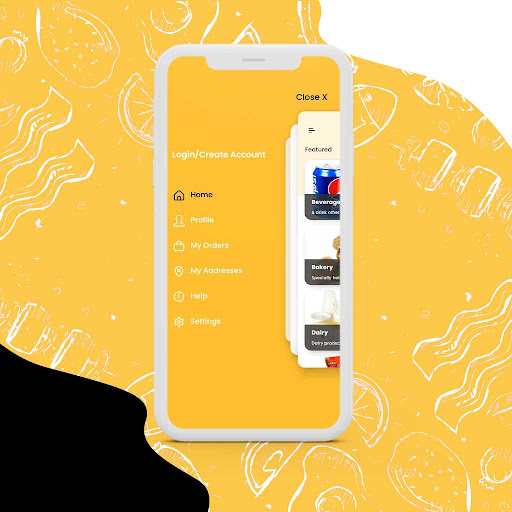
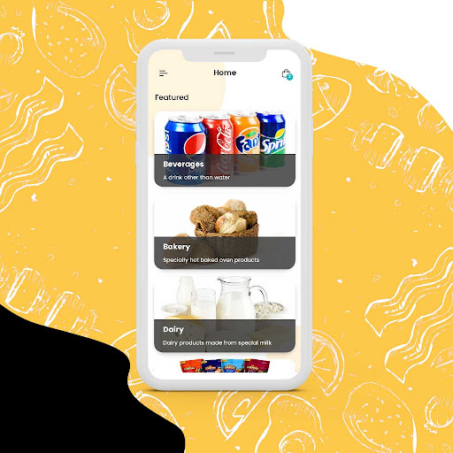
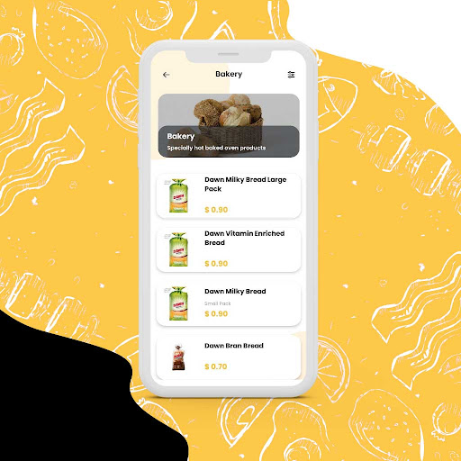
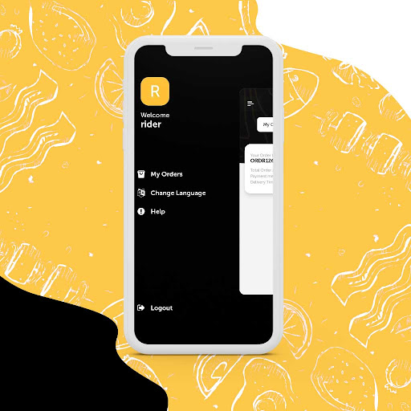
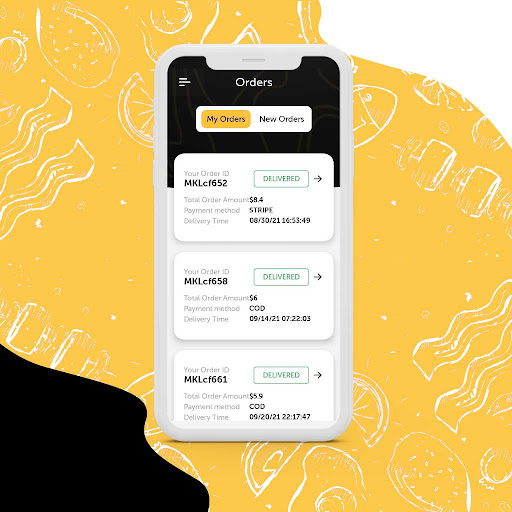
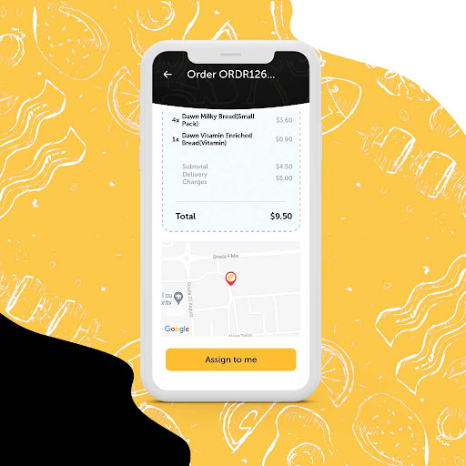
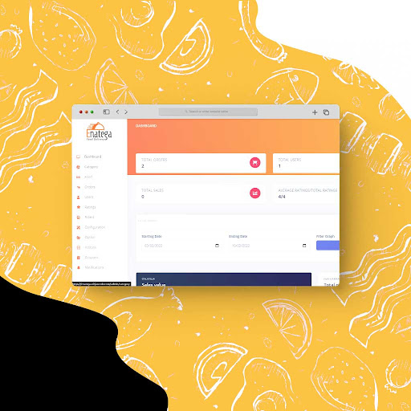
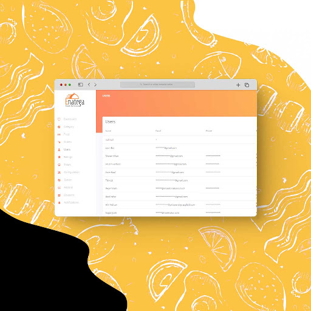
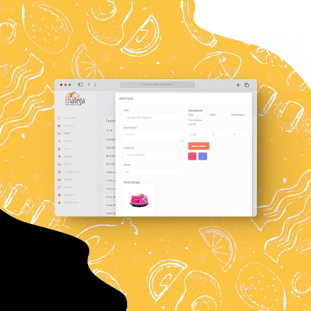

# Enatega Single Vendor Solution

 
Enatega is a state of the art white label storefront delivery solution that allows business owners to easily manage their deliveries. Whether they have a restaurant, grocery store, pharmacy, winery or any similar storefront, Enatega will intuitively and instantly be able to automate their deliveries, and handle the logistics. Our solution provides the capability of order management, as well as separate applications for the rider and the customer. It also boasts a suit of features which allow for a greater range of customizability for customers in terms of item selection.

<b>This is the full free source code of our solution, however the backend and API is proprietary and can be obtained via paid license.</b>

## What is included:

Our solution contains three separate modules. These include the admin panel, the delivery app and the rider app. Below, the capabilities of all three modules have been listed:

- The admin panel receives the orders that can be placed via the customer app. It also allows managing the restaurant’s orders as well as the riders’ accounts.(Run on node version 14)

- The customer app allows for customers to choose their specific selections and customize their order before placing it.

- The rider app can accept the orders and also allows for location based zoning as well as the ability to locate customer’s address via google map’s API integration.

## Features:

- Analytics dashboard for the mobile app
- Payment integration with Paypal and Stripe
- Order tracking feature
- Email Integration e.g for order confirmation etc.
- Ability to provide ratings and reviews
- Finding address using GPS integration
- Facebook and Google authentication integration
- Mobile responsive dashboard
- Multi-Language support using localization
- Separate rider app for order management
- Multiple variations of food items
- Push notifications for both mobile and web

## Setup

As we’ve mentioned above, the solution includes three separate modules. To setup these modules, follow the steps below:

To run the module, you need to have nodejs installed on your machine(Install node version 14). Once nodejs is installed, go to the directory and enter the following commands

The required credentials and keys have been set already. You can setup your own keys and credentials

The version of nodejs should be between 14.0 to 16.0

-[Link to Video tutorial/demonstration of Setup](https://enatega.com/singlevendor-documentation/)

## Screenshots

|                    Customer Menu                     |                 Customer Categories                  |                    Customer Items                    |
| :--------------------------------------------------: | :--------------------------------------------------: | :--------------------------------------------------: |
|  |  |  |

|                    Rider Menu                     |                   Rider Orders                    |                Rider Items Details                |
| :-----------------------------------------------: | :-----------------------------------------------: | :-----------------------------------------------: |
|  |  |  |

|                  Stats Overview                   |                    User Table                     |                Food Items Editing                 |
| :-----------------------------------------------: | :-----------------------------------------------: | :-----------------------------------------------: |
|  |  |  |

## High Level Architecture

- User Mobile App communicates with both API Server and [Amplitudes](https://amplitude.com/) analytics dashboard
- Web dashboard communicates with only API Server
- Rider App communicates with API Server

### Prerequisites:

##### App Ids for Mobile App in app.json

- Facebook Scheme
- Facebook App Id
- Facebook Display Name
- iOS Client Id Google
- Android Id Google
- Amplitude Api Key
- server url

##### Set credentials in API in file helpers/config.js and helpers/credentials.js

- Email User Name
- Password For Email
- Mongo User
- Mongo Password
- Mongo DB Name
- Reset Password Link
- Admin User name
- Admin Password
- User Id
- Name

##### Set credentials in Admin Dashboard in file src/index.js

- Firebase Api Key
- Auth Domain
- Database Url
- Project Id
- Storage Buck
- Messaging Sender Id
- App Id

##### NOTE: Email provider has been only been tested for gmail accounts

## Technologies:

- [Expo](https://expo.dev/)
- [React Navigation](https://reactnavigation.org/)
- [Apollo GraphQL](https://www.apollographql.com/)
- [ReactJS](https://reactjs.org/)
- [NodeJS](https://nodejs.org/en/)
- [MongoDB](https://www.mongodb.com/)
- [Firebase](https://firebase.google.com/)
- [Amplitude](https://amplitude.com/)
- [React Native](https://reactnative.dev/)
- [React Router](https://reactrouter.com/)
- [GraphQL](https://graphql.org/)
- [ExpressJS](https://expressjs.com/)
- [React Strap](https://reactstrap.github.io/)

## Demos

- [Customer App Android](https://play.google.com/store/apps/details?id=com.enatega.vendor)
  

- [Customer App iOS](https://apps.apple.com/pk/app/enatega/id1493209281)
  

- [Rider App Android](https://play.google.com/store/apps/details?id=com.enatega.rider)
  

- [Rider App iOS](https://apps.apple.com/pk/app/enatega-rider-app/id1493291047)
  

- [Admin Dashboard](https://inspiring-kirch-8454fc.netlify.app/)

## Documentation and Product Demo Video:

Find the link for the complete documentation of the Enatega Single Vendor Solution [here](https://enatega.com/singlevendor-documentation/).

If you want to see demo video of the product please check out the link over [here](https://www.youtube.com/watch?v=AWbdt9GX1t4&t=3s&ab_channel=NinjasCode)

## Contributing:

Enatega Restuarant Solution is an open source project. We welcome contributions of all kinds including documentation, bug fixes, feature requests, and code. Please read our [contributing guide](./contributingGuides/CONTRIBUTING.md) for more information on how you can contribute.

## Get the Latest News

- [Facebook](https://www.facebook.com/enatega)
- [Twitter](https://twitter.com/EnategaA)
- [Instagram](https://www.instagram.com/enatega.nb/)
- [LinkedIn](https://www.linkedin.com/company/14583783/)

## Disclaimer:

The frontend source code for our solution is completely open source. However, the API and backend is proprietary and can be accessed via a paid license. For further information, contact us on the channels provided below.

## Contact Us:

sales@enatega.com
